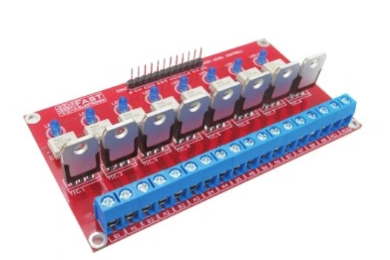

## Zestawienie połączeń GPIO Arduino z pozostałymi modułami.

1) Nie wymieniamy tu pinów GND - wszystkie elementy mają wspólne GND.

2) VCC - zasilanie Arduino oraz komponentów +5V. 
Arduino zasilamy poprzez wejście zasilania, albo podłączając zasilacz 9V do pinu VIN.
Pozostałe komponenty wymagające zasilania VCC +5V zasilamy z pinu +5V Arduino. Arduino odpowiada za dostarczenie napięcia +5V.

3) Część sterującą można połączyć bez lutowania (kabelki połączeniowe i złącza pin), ale jeśli sterownik ma działać niezawodnie przez długi czas to połączenia lutowane są lepsze.

| Pin Arduino | Drugi koniec |
| --- | --- |
|  | *Moduł wykonawczy SSR* |
| 2 | DET - detekcja 0 |
| A9 | Pompa CO |
| A10 | Podajnik |
| A11 | Pompa cyrkulacji |
| A13 | Dmuchawa |
| A14 | POMPA CO 2 |
| A15 | POMPA CWU | 
|  | *Termostat* |
| 47 | Termostat we |
| 26 | Termostat alternatywne wejscie (NC) |
|  | *Termopara/czujnik spalin* |
| 39 | MAX 6675 SCK |
| 40 | MAX 6675 SO |
| 41 | MAX 6675 CS |
|  | *czujniki DALLAS DS18B20* |
| 22 | DATA |
|  | *Enkoder* |
| 15 | PIN A |
| 18 | PIN B |
| 34 | Przycisk |
|  | *Wyswietlacz I2C oraz moduł RTC*|
| 20 SDA | SDA |
| 21 SCL | SCL |

## Podłączenie wyświetlacza i RTC
Oba moduły komunikują się przez I2C i korzystają z tych samych pinów. Moduł RTC jest 'przelotowy' czyli można wyświetlacz podłączyć do niego.

## Podłączenie czujników DS18B20
Łączymy je równolegle. Złącze DATA - na pin 22 Arduino.
Dodatkowo VCC i GND. Między VCC a Data należy dać rezystor 3.3K

## Podłączenie termopary MAX 6675
Wykorzystuje interfejs SPI wbudowany w Arduino
Czasami konieczne jest dodatkowe połączenie '-' termopary z gnd - gdy brak odczytu lub dostajemy jakieś bezsensowne odczyty.

## Zestawienie Modułów

| Moduł | Liczba szt | Informacje |
| --- | --- | --- |
| Arduino 2560 Mega | 1 | klon zupełnie wystarcza |
| Ethernet shield W5100 | 1 | Aktualnie nie używamy ethernetu, wyłącznie karty SD. Ale warto mieć możliwość podłączenia sieci |
| Moduł Przekaźnika 8x SSR Triaki Detekcja 0 ARDUINO | 1 | z firmy Fast Electronic (dostępne z Allegro) wybrać z optotriakiem MOC3021 choć druga wersja MOC3041 też powinna działać  . Istotna jest funkcja detekcji zera do sterowania dmuchawą, dlatego został wybrany ten moduł. Można użyć innego ale wtedy trzeba zapewnić detekcję zera osobnym modułem.  |
| Zegar RTC DS1307 | 1 | |
| Wyświetlacz LCD 2x16 I2C | 1 | komplet z konwerterem i2c |
| Enkoder | 1 | Dowolny z przyciskiem |
| Czujnik temperatury DS18B20 | 4 | czujniki z kablem, wybrać kable odpowiedniej długości (temp CO, temp CWU, temp. powrotu, temp podajnika) |
| MAX 6675 | 1 | moduł termopary z termoparą 400st, ale może też być 600 lub 800 stopni |
| Zasilacz 9V | 1 | zasilacz dla arduino (od 7.5 do 10V, 10W powinno wystarczyć) |
| Gniazdo AC komputerowe 3pin | 5 | zasilanie pomp, podajnika, dmuchawy |
| Zabezpieczenie STB | 1 | Wyłącznik bimetaliczny NC 90 stopni C |

## Połączenia 230V oraz zasilanie

Połączenia 230V obejmują sterowanie zasilaniem pomp, podajnika, dmuchawy poprzez wyjścia modułu wykonawczego SSR.
Dodatkowo z wejścia 230V zasilany jest też zasilacz 9V dla Arduino. Tylko w w/w elementach występuje napięcie 230V, dobrze jest sekcję 230V oddzielić od pozostałej części sterownika która działa na niskim napięciu. Zapewnić odpowiednią izolację połąćzeń 230V, taśma PCV potrafi się odklejać przy pracy w wyższej temperaturze - nie polecam.
Wygodnie jest użyć komputerowego wejścia zasilania z wyłącznikiem i bezpiecznikiem.

Uwaga: nie precyzuję tu które kanały modułu wykonawczego mają być przypisane do poszczególnych urządzeń - pomp, podajnika, dmuchawy. Jest to dowolne, ale należy pamiętać o połączeniu wybranych kanałów z odpowienim pinem arduino wg rozpiski wyżej.

## Uruchamianie sterownika

Zalecam podejście krok po kroku:

1. Zasilanie Arduino 9v oraz połączenie USB z laptopem. Kompilujemy i wgrywamy masterpiec do Arduino. Program powinien wystartować (na porcie szeregowym będą komunikaty)
2. Podłączenie wyświetlacza, RTC oraz enkodera. Po uruchomieniu Masterpiec powinien wyświetlać cokolwiek na ekranie, enkoder powinien pozwalać poruszać się po menu. Prawdopodobnie na początku będzie alarm o braku czujnika temperatury.
3. Komunikaty diagnostyczne są wypisywane na port szeregowy
4. Podłączenie czujników Dallas. Po podłączeniu konieczne jest wejście w menu zaawansowane i przypisanie ról poszczególnym czujnikom (identyfikacja który jest CO, CWU itd). Upewnić się że mamy odczyt temperatury. Robimy to raz bo później ustawienia są pamiętane w EEPROM.
5. Podłączenie modułu wykonawczego SSR. Detekcja zera jest istotna, bez niej nie będzie działać sterowanie dmuchawą - czyli moduł należy podłączyć do napięcia sieciowego 230V. Można testować bez podłączania zasilanych urządzeń, są diody wskazujące stan poszczególnych wyjść.
6. Podłączenie termopary, upewnienie się że mamy odczyt temp spalin.
7. Po upewnieniu się że wszystkie komponenty działają możemy podłączyć sterownik do pieca.
8. Zabezpieczenie STB - wyłącznik montujemy na wyjściu gorącej wody z kotła, połączone w szereg w obwodzie zasilania dmuchawy (uwaga 230v)

